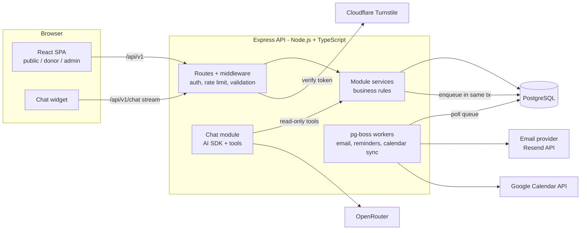
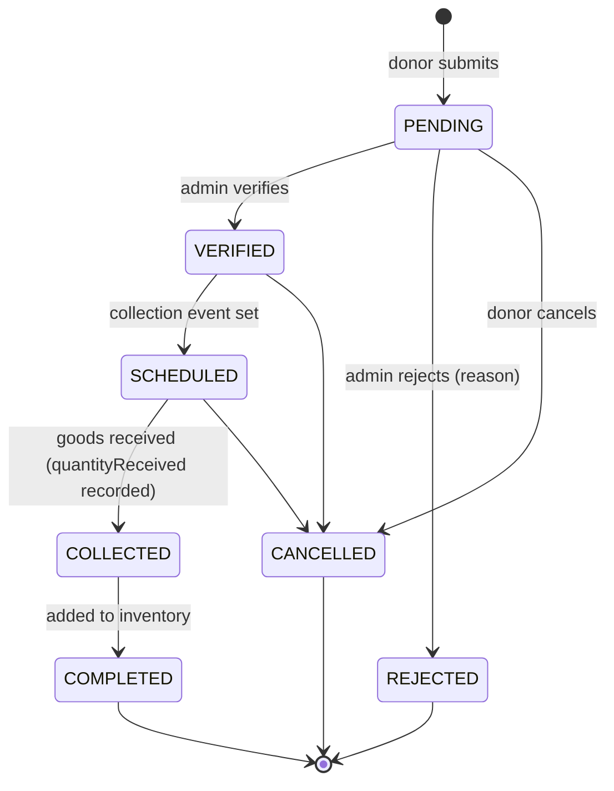
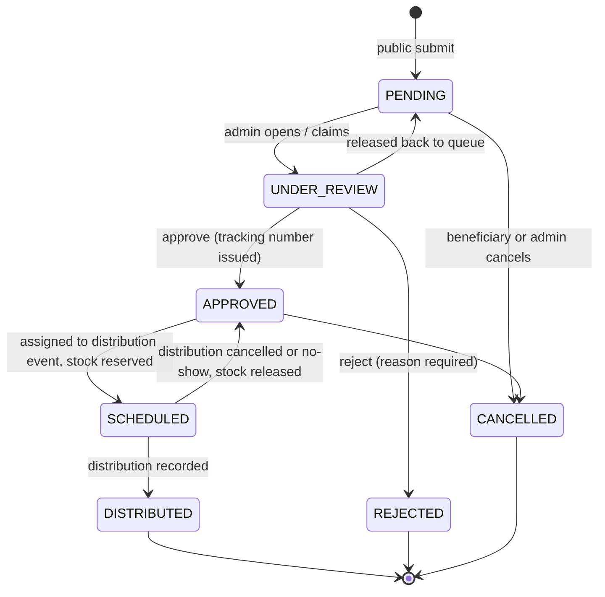
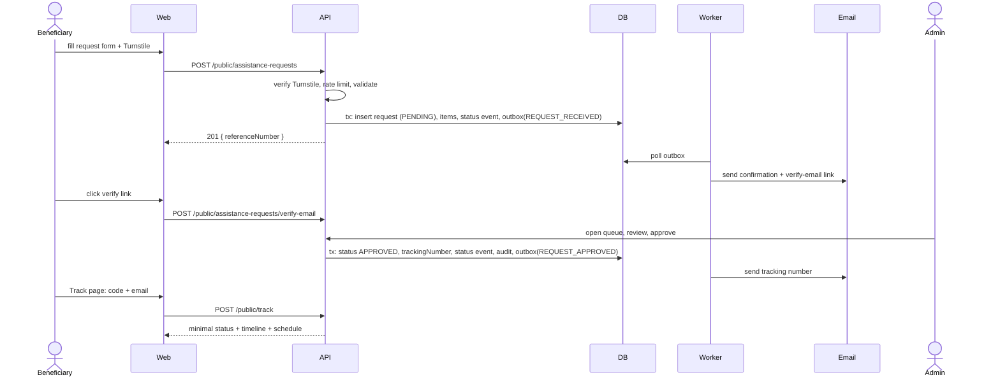
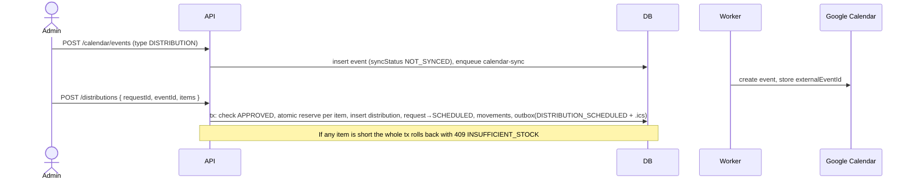

# AGAPAY — Architecture

> Companion to `PLAN.md`. Decision IDs (D-xx) refer to `PLAN.md` §3.

---

## 1. Style: Modular Monolith

One deployable API, one SPA, one PostgreSQL database. Code is split into **modules** with clear boundaries so it can be understood by a small team and split later if ever needed. No microservices, no Redis, no message broker.



Key idea: **request handlers never call external services directly** (email, calendar). They write to the database, including an outbox row, in one transaction. Workers do the external calls. This keeps requests fast, makes retries safe, and means a provider outage never loses a state change.

---

## 2. Backend Layers

```
HTTP request
   │
   ▼
Route            path + method + middleware chain (auth, role, rate limit, validate)
   │
   ▼
Controller       parse validated input, call ONE service method, shape the response
   │
   ▼
Service          business rules, state transitions, transactions, outbox writes, audit
   │
   ▼
Repository       Prisma queries only (optional: small modules can call Prisma in the service)
   │
   ▼
PostgreSQL
```

Rules of the layers:

- Controllers contain **no** business logic and **no** Prisma calls.
- Services own transactions (`prisma.$transaction`) and are the only place state changes happen.
- Services never import Express types. They take plain inputs and return plain data, so the chatbot tools and jobs reuse them.
- Modules talk to each other **through services**, never by reaching into another module's tables directly (reads for reports are the one exception, via the `reports` module).

### Module map

| Module          | Owns                                                           | Depends on                                            |
| --------------- | -------------------------------------------------------------- | ----------------------------------------------------- |
| `auth`          | register, verify email, login, refresh, logout, password reset | `users`, `notifications`                              |
| `users`         | user CRUD, roles, activation                                   | `audit`                                               |
| `item-types`    | goods catalog and per-item limits                              | none                                                  |
| `campaigns`     | campaigns, affected areas, priority goods                      | `item-types`                                          |
| `donations`     | donation lifecycle and items                                   | `campaigns`, `inventory`, `calendar`, `notifications` |
| `inventory`     | stock counters, movements ledger                               | `item-types`, `campaigns`                             |
| `requests`      | assistance requests, status timeline, tracking codes           | `campaigns`, `notifications`                          |
| `distributions` | allocations of stock to requests within an event               | `requests`, `inventory`, `calendar`, `notifications`  |
| `calendar`      | events, Google sync, .ics generation                           | none (external sync via jobs)                         |
| `notifications` | email outbox, templates, provider adapter                      | none                                                  |
| `reports`       | read-only aggregates, CSV                                      | reads all                                             |
| `public`        | unauthenticated endpoints (campaigns, request submit, track)   | `requests`, `campaigns`                               |
| `chat`          | persona prompts, tools, quotas                                 | read services only                                    |
| `audit`         | audit log writes and viewer                                    | none                                                  |

---

## 3. State Machines

State changes are only allowed through service methods that check the current state. Illegal transitions throw `409 INVALID_STATE_TRANSITION`.

### 3.1 Donation



`COLLECTED` to `COMPLETED` happens in the same transaction as the inventory increase in the normal path. The two states stay separate so a failed inventory write can be seen and repaired.

### 3.2 Assistance request



Every transition writes a `RequestStatusEvent` row. That table drives the public timeline and the admin history.

### 3.3 Distribution (a request's allocation within an event)

`SCHEDULED` → `DISTRIBUTED` | `NO_SHOW` | `CANCELLED`. `NO_SHOW` and `CANCELLED` release reserved stock and return the request to `APPROVED`.

### 3.4 Inventory movements

```
DONATION_IN     available += received                (donation completed)
RESERVE         available -= q ; reserved += q       (distribution scheduled)
RELEASE         reserved  -= q ; available += q      (distribution cancelled / no-show)
DISTRIBUTE      reserved  -= q ; distributed += q    (distribution recorded)
ADJUSTMENT_IN   available += q                       (stock count correction, reason required)
ADJUSTMENT_OUT  available -= q                       (damage, expiry, loss, reason required)
```

Invariant: `available >= 0`, `reserved >= 0`, `distributed >= 0` (database `CHECK`). Total on hand = `available + reserved + distributed` and is computed, not stored.

---

## 4. Core Sequences

### 4.1 Beneficiary request → tracking (no account)



### 4.2 Scheduling a distribution



The atomic reserve is one statement per inventory row:

```sql
UPDATE "InventoryItem"
SET available = available - $qty, reserved = reserved + $qty
WHERE id = $id AND available >= $qty;
-- 0 rows updated => insufficient stock => abort the transaction
```

### 4.3 Email outbox

```
service (inside tx)   INSERT EmailNotification(status=QUEUED, dedupeKey, scheduledFor)
                      enqueue pg-boss job "email.send" { id }   (or worker scans QUEUED)
worker                claim row (SELECT ... FOR UPDATE SKIP LOCKED) → status SENDING
                      render template → provider.send()
                      success: SENT + providerMessageId + sentAt
                      failure: attempts++, backoff (1m, 5m, 30m, 2h, 12h), after 5 → FAILED
daily budget          before sending, check today's SENT count vs EMAIL_DAILY_LIMIT;
                      over budget → defer to next day, except priority types
priority              1 tracking/approval/rejection, 2 verification + schedule, 3 reminders
```

`dedupeKey` (e.g. `REQUEST_APPROVED:<requestId>`) has a unique index, so a retried transaction can never queue the same email twice.

---

## 5. Authentication and Authorization

| Aspect             | Design                                                                                                                                                                                    |
| ------------------ | ----------------------------------------------------------------------------------------------------------------------------------------------------------------------------------------- |
| Accounts           | Donors self-register. Admin/staff are created by an admin or the seed script. There is **no** public admin sign-up.                                                                       |
| Password           | argon2id hash. Min length 10, checked against a small common-password list.                                                                                                               |
| Access token       | JWT, 15 minutes, in memory on the client, sent as `Authorization: Bearer`. Claims: `sub`, `role`.                                                                                         |
| Refresh token      | Random 256-bit value in an **httpOnly, Secure, SameSite=Lax** cookie, 7 days, **rotated on every use**. Only its hash is stored. Reuse of a rotated token revokes the whole token family. |
| CSRF               | Refresh and logout are cookie-based, so require a custom header (`X-Requested-With: agapay`) and check `Origin`. Bearer-authenticated routes are not CSRF-exposed.                        |
| Same-site cookies  | Serve web and API on the same site or proxy `/api/*` from the web host, otherwise browsers may drop the cookie.                                                                           |
| RBAC               | `requireRole('ADMIN' \| 'STAFF' \| 'DONOR')` middleware plus **ownership checks in services** (a donor only reads their own donations). Middleware alone is not enough.                   |
| Email verification | Random token, hash stored, 24 h expiry, single use.                                                                                                                                       |
| Public endpoints   | No auth. Turnstile, rate limits, minimal responses.                                                                                                                                       |

Permission matrix (summary):

| Capability                                 | Public |  Donor   | Staff |        Admin         |
| ------------------------------------------ | :----: | :------: | :---: | :------------------: |
| View active campaigns                      |   ✔    |    ✔     |   ✔   |          ✔           |
| Submit / track assistance request          |   ✔    |    ✔     |   ✔   |          ✔           |
| Submit and view own donations              |        |    ✔     |       |                      |
| Verify/reject donations, record collection |        |          |   ✔   |          ✔           |
| Review, approve, reject requests           |        |          |   ✔   |          ✔           |
| Manage inventory, adjustments              |        |          |   ✔   |          ✔           |
| Schedule events, distributions             |        |          |   ✔   |          ✔           |
| Reports and dashboard                      |        | own only |   ✔   |          ✔           |
| Manage campaigns, item types               |        |          | view  |          ✔           |
| Manage users, settings, view audit log     |        |          |       |          ✔           |
| Delete records                             |        |          |       | ✔ (soft delete only) |

---

## 6. Public Tracking Security (proposal §29)

- Lookup is `POST /public/track { code, email }`. Code may be `REQ-` or `TRK-`. The email must match the request (case-insensitive, normalised).
- Any failure (unknown code, wrong email, wrong format) returns the **same** `404 NOT_FOUND` with the same timing behaviour, so codes cannot be probed.
- Rate limit: 10 attempts per IP per 15 min and 5 per code per hour; then `429`.
- Response contains only: campaign name, current status, timeline (status + timestamps), rejection reason (if rejected, written for the beneficiary), distribution date, time, and location. **Never** phone, address, notes, admin names, or other requests.
- Tracking codes: 8 characters from a 32-character alphabet = 40 bits, generated with `crypto.randomInt`. The reference number is sequential and therefore guessable, which is why it is useless without the email.

---

## 7. Calendar Integration

- **Source of truth is Agapay's database.** Google Calendar is a mirror for staff visibility.
- One shared Google calendar, "Agapay Operations". A **service account** is given "Make changes to events" on it; admins are given view access with their own Google accounts.
- `CalendarEvent.syncStatus`: `NOT_SYNCED` → `SYNCED` | `FAILED`. A `calendar.sync` job creates, updates, or deletes the Google event and stores `externalEventId`. Failures retry with backoff and show a badge in the admin calendar.
- Beneficiaries and donors get an **.ics attachment** (generated with the `ics` package) in schedule emails. That is how they add the event to their own calendar without any account.
- Google credentials live only in environment variables; never in the repository.

---

## 8. AI Chatbot Overview

Full design in `chatbot.md`. Architectural constraints:

- Runs inside the API (`chat` module) using the Vercel AI SDK with the OpenRouter provider. The browser never sees the OpenRouter key.
- **Read-only tools** call existing services. The model cannot approve, reject, verify, schedule, or edit anything.
- Persona and tool set are chosen **server-side** from the authenticated role. The client cannot ask for admin tools.
- Quotas and a global daily budget protect the free-tier limits. If the model is unavailable the widget falls back to a static FAQ.

---

## 9. Background Jobs and the Sleeping Free Host

| Job              | Trigger                         | Purpose                                                                              |
| ---------------- | ------------------------------- | ------------------------------------------------------------------------------------ |
| `email.send`     | on enqueue + sweep every minute | send queued outbox rows                                                              |
| `email.sweep`    | every minute                    | pick up `QUEUED` rows missed, retry `FAILED` with attempts left                      |
| `calendar.sync`  | on event change                 | mirror to Google                                                                     |
| `reminders.scan` | hourly                          | find distributions and collections in the next 24 h without a reminder, queue emails |
| `retention.scan` | daily                           | anonymise expired beneficiary data (D-13)                                            |

Because free hosts sleep:

1. Run pg-boss **inside the API process** (single service to deploy).
2. Ping `GET /api/v1/health` every 5 to 10 minutes from a free uptime monitor or a scheduled GitHub Action, which keeps the free instance awake and gives you uptime alerts. Point the host's health-check path at the same URL.
3. Make every job **idempotent and catch-up based** (scan for what is due, do not rely on an exact timer firing).
4. On a paid or VPS deployment, no design change is needed.

Neon note: the app uses the pooled connection string; **migrations and pg-boss use the direct connection** (`DIRECT_URL`), since pg-boss relies on features that pooled connections do not always support.

---

## 10. Cross-Cutting Concerns

| Concern       | Approach                                                                                                                                                                                           |
| ------------- | -------------------------------------------------------------------------------------------------------------------------------------------------------------------------------------------------- |
| Validation    | Zod schemas in `packages/shared`; API validates body, params, query; web reuses them in forms.                                                                                                     |
| Errors        | Custom `AppError(code, status, message, details)`. One error middleware maps to the JSON error envelope in `api.md`. Unknown errors become `500 INTERNAL` with a request ID, details only in logs. |
| Logging       | `pino` JSON logs, request ID on every line. **Redact** passwords, tokens, emails, phones, Authorization header.                                                                                    |
| Config        | Single `env.ts` that parses `process.env` with Zod and crashes at boot if invalid.                                                                                                                 |
| Transactions  | Any change touching more than one row/table happens in one `prisma.$transaction`.                                                                                                                  |
| Audit         | Every admin/staff state change writes `AuditLog` (who, what, entity, before/after summary).                                                                                                        |
| Soft delete   | Campaigns, item types, users use `isActive` / `archivedAt`. Donations, requests, distributions, movements are never deleted.                                                                       |
| Time          | Store UTC (`timestamptz`), display in `Asia/Manila`. Event times shown with time zone.                                                                                                             |
| Pagination    | Offset pagination with a max page size (100).                                                                                                                                                      |
| Observability | `/api/v1/health` (liveness), `/api/v1/health/ready` (DB check). Error tracking (Sentry free tier) optional.                                                                                        |
| Backups       | Provider point-in-time restore if available; otherwise a scheduled `pg_dump` to storage. Test a restore once before launch.                                                                        |

---

## 11. Environments and Configuration

| Env                | Web               | API             | DB                                   | Email                                       |
| ------------------ | ----------------- | --------------- | ------------------------------------ | ------------------------------------------- |
| Local              | Vite dev server   | `tsx watch`     | Postgres (not yet provisioned)       | `console` adapter — logs instead of sending |
| CI                 | none              | test server     | ephemeral Postgres service container | stub provider                               |
| Staging (optional) | free host preview | free host       | separate Neon branch/project         | Resend with a test sender                   |
| Production         | static host       | Render (or VPS) | Neon / Supabase (or VPS Postgres)    | Resend, authenticated domain                |

Required environment variables (API):

```
NODE_ENV
PORT
DATABASE_URL            pooled / app connection
DIRECT_URL              direct connection (migrations, pg-boss)
JWT_ACCESS_SECRET
COOKIE_DOMAIN
WEB_ORIGIN              allowed CORS origin and link base
EMAIL_PROVIDER          resend | console
RESEND_API_KEY          required when EMAIL_PROVIDER=resend
EMAIL_FROM
EMAIL_DAILY_LIMIT       default 90 (headroom under Resend's 100/day free cap)
GOOGLE_SERVICE_ACCOUNT_JSON   (base64)
GOOGLE_CALENDAR_ID
TURNSTILE_SECRET
OPENROUTER_API_KEY
OPENROUTER_MODEL
OPENROUTER_FALLBACK_MODELS   comma-separated
CHAT_USER_DAILY_LIMIT / CHAT_GLOBAL_DAILY_LIMIT
```

Web: `VITE_API_BASE_URL`, `VITE_TURNSTILE_SITE_KEY`. Only non-secret values may have the `VITE_` prefix.

---

## 12. Testing Strategy

| Level           | Tool                                                      | Focus                                                                                                               |
| --------------- | --------------------------------------------------------- | ------------------------------------------------------------------------------------------------------------------- |
| Unit            | Vitest                                                    | state-machine guards, code generators, quantity math, email templates                                               |
| API integration | Vitest + Supertest + real Postgres (CI service container) | each endpoint, RBAC, validation errors, transactions, concurrency (two simultaneous reservations for the last item) |
| Component       | Testing Library                                           | forms, status timeline, empty/error states                                                                          |
| End to end      | Playwright                                                | the **17-step MVP flow** as one scenario, plus tracking with wrong email                                            |
| Security checks | scripted                                                  | rate-limit behaviour, tracking enumeration, injection tests for the chatbot                                         |

CI (GitHub Actions) runs: install, typecheck, lint, unit, integration (with Postgres service), build. E2E runs on main and before release.

---

## 13. Deployment Topology

```
Browser ──► Static host (SPA)  ── rewrite /api/* ──►  Render web service (Express + pg-boss)
                                                          │
                                                          ├──► Neon Postgres (pooled + direct)
                                                          ├──► Resend
                                                          ├──► Google Calendar
                                                          └──► OpenRouter
```

Migration flow: CI or a release step runs `prisma migrate deploy` against `DIRECT_URL` **before** the new API version starts. Migrations must be backward compatible for one release (add columns nullable first, backfill, then tighten).
