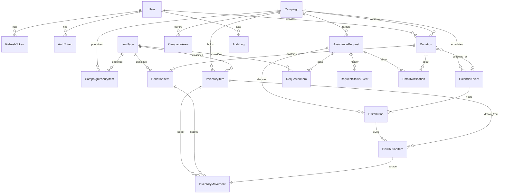

# AGAPAY — Database

> PostgreSQL + Prisma. Extends the logical model in the proposal (§18) using the decisions in `PLAN.md` §3.
> The Prisma syntax below targets the classic `prisma-client-js` setup. If you scaffold with a newer Prisma major, keep the models and move connection settings to whatever that version expects.
>
> **Every `DateTime` carries `@db.Timestamptz(3)`.** Prisma's bare `DateTime` maps to a naive
> `TIMESTAMP(3)` with no time zone, which cannot represent the `Asia/Manila` display rule in
> `architecture.md` §10. The annotation is required on every timestamp field, so the models below
> are written with it elided for width — the canonical form is `apps/api/prisma/schema.prisma`:

```prisma
model User {
  id              String    @id @default(uuid())
  name            String
  email           String    @unique // stored lowercase
  passwordHash    String
  role            UserRole  @default(DONOR)
  phone           String?
  emailVerifiedAt DateTime? @db.Timestamptz(3)
  createdAt       DateTime  @default(now()) @db.Timestamptz(3)
  updatedAt       DateTime  @updatedAt @db.Timestamptz(3)
  // ...
}
```

---

## 1. Changes from the Proposal's Logical Model

| Proposal                                     | Here                                                                              | Reason                                               |
| -------------------------------------------- | --------------------------------------------------------------------------------- | ---------------------------------------------------- |
| `Distribution` = request + date + location   | `CalendarEvent` (the event) + `Distribution` (a request's allocation in an event) | One event serves many beneficiaries (G4).            |
| `InventoryItem` with `total_quantity` stored | No stored total; add `InventoryMovement` ledger                                   | Totals derive from parts and drift when stored (G5). |
| Inventory not tied to campaign               | `InventoryItem` unique on `(itemType, campaign)`                                  | Prevent cross-campaign leakage (G6, D-16).           |
| Free-text item names                         | `ItemType` catalog with limits                                                    | Reporting, limits, matching (G8, D-06).              |
| `DonationItem.quantity`                      | `quantityDeclared` + `quantityReceived` + `expiryDate`                            | Only received goods count (G7).                      |
| No history                                   | `RequestStatusEvent`, `AuditLog`                                                  | Timeline, accountability.                            |
| `EmailNotification`                          | Same table used as the **outbox** with retry fields + `dedupeKey`                 | Reliable delivery (G9).                              |
| Beneficiary in `User` (original)             | No beneficiary user; request holds contact data                                   | Updated direction.                                   |

---

## 2. Entity Relationship Diagram



---

## 3. Prisma Schema

```prisma
// apps/api/prisma/schema.prisma

generator client {
  provider = "prisma-client-js"
}

datasource db {
  provider  = "postgresql"
  url       = env("DATABASE_URL")
  directUrl = env("DIRECT_URL")
}

// ───────────── Enums ─────────────

enum UserRole {
  DONOR
  STAFF
  ADMIN
}

enum AuthTokenType {
  VERIFY_EMAIL
  RESET_PASSWORD
}

enum CampaignStatus {
  DRAFT
  ACTIVE
  COMPLETED
  ARCHIVED
}

enum CalamityType {
  TYPHOON
  FLOOD
  EARTHQUAKE
  FIRE
  VOLCANIC_ERUPTION
  LANDSLIDE
  OTHER
}

enum ItemCategory {
  FOOD
  WATER
  CLOTHING
  HYGIENE
  BEDDING
  SCHOOL
  OTHER
}

enum DonationStatus {
  PENDING
  REJECTED
  VERIFIED
  SCHEDULED
  COLLECTED
  COMPLETED
  CANCELLED
}

enum RequestStatus {
  PENDING
  UNDER_REVIEW
  APPROVED
  REJECTED
  SCHEDULED
  DISTRIBUTED
  CANCELLED
}

enum DistributionStatus {
  SCHEDULED
  DISTRIBUTED
  NO_SHOW
  CANCELLED
}

enum CalendarEventType {
  DONATION_DRIVE
  COLLECTION
  DISTRIBUTION
}

enum CalendarEventStatus {
  SCHEDULED
  COMPLETED
  CANCELLED
}

enum SyncStatus {
  NOT_SYNCED
  SYNCED
  FAILED
}

enum MovementType {
  DONATION_IN
  RESERVE
  RELEASE
  DISTRIBUTE
  ADJUSTMENT_IN
  ADJUSTMENT_OUT
}

enum EmailStatus {
  QUEUED
  SENDING
  SENT
  FAILED
  SUPPRESSED
}

enum NotificationType {
  DONOR_VERIFY_EMAIL
  DONOR_PASSWORD_RESET
  DONATION_SUBMITTED
  DONATION_VERIFIED
  DONATION_REJECTED
  COLLECTION_SCHEDULED
  COLLECTION_REMINDER
  REQUEST_RECEIVED
  REQUEST_VERIFY_EMAIL
  REQUEST_APPROVED
  REQUEST_REJECTED
  REQUEST_STATUS_UPDATED
  DISTRIBUTION_SCHEDULED
  DISTRIBUTION_REMINDER
  DISTRIBUTION_COMPLETED
  DISTRIBUTION_CANCELLED
}

// ───────────── Auth and users ─────────────

model User {
  id              String    @id @default(uuid())
  name            String
  email           String    @unique // stored lowercase
  passwordHash    String
  role            UserRole  @default(DONOR)
  phone           String?
  emailVerifiedAt DateTime?
  isActive        Boolean   @default(true)
  lastLoginAt     DateTime?
  createdAt       DateTime  @default(now())
  updatedAt       DateTime  @updatedAt

  refreshTokens RefreshToken[]
  authTokens    AuthToken[]
  donations     Donation[]
  auditLogs     AuditLog[]

  @@index([role, isActive])
}

model RefreshToken {
  id        String    @id @default(uuid())
  userId    String
  familyId  String // all rotations of one login share a family
  tokenHash String    @unique
  expiresAt DateTime
  revokedAt DateTime?
  createdAt DateTime  @default(now())
  userAgent String?
  ipHash    String?

  user User @relation(fields: [userId], references: [id], onDelete: Cascade)

  @@index([userId])
  @@index([familyId])
}

model AuthToken {
  id        String        @id @default(uuid())
  userId    String
  type      AuthTokenType
  tokenHash String        @unique
  expiresAt DateTime
  usedAt    DateTime?
  createdAt DateTime      @default(now())

  user User @relation(fields: [userId], references: [id], onDelete: Cascade)

  @@index([userId, type])
}

// ───────────── Catalog and campaigns ─────────────

model ItemType {
  id                 String       @id @default(uuid())
  name               String       @unique // "Food Pack"
  category           ItemCategory
  unit               String // "pack", "liter", "piece"
  lowStockThreshold  Int          @default(20)
  maxPerRequest      Int? // D-06, null = no cap
  perHouseholdMember Int? // e.g. 1 pack per member
  isActive           Boolean      @default(true)
  createdAt          DateTime     @default(now())
  updatedAt          DateTime     @updatedAt

  donationItems    DonationItem[]
  requestedItems   RequestedItem[]
  inventoryItems   InventoryItem[]
  priorityForCamps CampaignPriorityItem[]
}

model Campaign {
  id           String         @id @default(uuid())
  name         String
  slug         String         @unique
  description  String
  calamityType CalamityType
  status       CampaignStatus @default(DRAFT)
  isSystem     Boolean        @default(false) // the "General Pool" campaign
  startDate    DateTime
  endDate      DateTime?
  coverImageUrl String?
  createdById  String?
  createdAt    DateTime       @default(now())
  updatedAt    DateTime       @updatedAt

  areas          CampaignArea[]
  priorityItems  CampaignPriorityItem[]
  donations      Donation[]
  requests       AssistanceRequest[]
  inventoryItems InventoryItem[]
  events         CalendarEvent[]

  @@index([status, startDate])
}

model CampaignArea {
  id         String @id @default(uuid())
  campaignId String
  barangay   String
  city       String
  province   String

  campaign Campaign @relation(fields: [campaignId], references: [id], onDelete: Cascade)

  @@unique([campaignId, barangay, city, province])
}

model CampaignPriorityItem {
  campaignId     String
  itemTypeId     String
  targetQuantity Int?

  campaign Campaign @relation(fields: [campaignId], references: [id], onDelete: Cascade)
  itemType ItemType @relation(fields: [itemTypeId], references: [id])

  @@id([campaignId, itemTypeId])
}

// ───────────── Donations ─────────────

model Donation {
  id                  String         @id @default(uuid())
  referenceNumber     String         @unique // DON-2026-000123
  donorId             String
  campaignId          String // General Pool campaign when donor picks none
  status              DonationStatus @default(PENDING)
  preferredDate       DateTime?
  preferredNote       String?
  collectionEventId   String?
  notes               String?
  rejectionReason     String?
  submittedAt         DateTime       @default(now())
  verifiedById        String?
  verifiedAt          DateTime?
  collectedById       String?
  collectedAt         DateTime?
  completedAt         DateTime?
  updatedAt           DateTime       @updatedAt

  donor           User            @relation(fields: [donorId], references: [id])
  campaign        Campaign        @relation(fields: [campaignId], references: [id])
  collectionEvent CalendarEvent?  @relation(fields: [collectionEventId], references: [id])
  items           DonationItem[]
  emails          EmailNotification[]

  @@index([donorId, submittedAt])
  @@index([status, submittedAt])
  @@index([campaignId, status])
}

model DonationItem {
  id               String   @id @default(uuid())
  donationId       String
  itemTypeId       String
  customName       String? // when itemType is "Other"
  description      String?
  quantityDeclared Int
  quantityReceived Int? // set at collection
  expiryDate       DateTime?

  donation  Donation            @relation(fields: [donationId], references: [id], onDelete: Cascade)
  itemType  ItemType            @relation(fields: [itemTypeId], references: [id])
  movements InventoryMovement[]

  @@index([donationId])
}

// ───────────── Inventory ─────────────

model InventoryItem {
  id          String   @id @default(uuid())
  itemTypeId  String
  campaignId  String
  available   Int      @default(0)
  reserved    Int      @default(0)
  distributed Int      @default(0)
  updatedAt   DateTime @updatedAt

  itemType ItemType @relation(fields: [itemTypeId], references: [id])
  campaign Campaign @relation(fields: [campaignId], references: [id])

  movements       InventoryMovement[]
  distributionItems DistributionItem[]

  @@unique([itemTypeId, campaignId])
  @@index([campaignId])
}

model InventoryMovement {
  id                 String       @id @default(uuid())
  inventoryItemId    String
  type               MovementType
  quantity           Int // always positive; direction comes from type
  availableAfter     Int
  reservedAfter      Int
  distributedAfter   Int
  reason             String? // required for ADJUSTMENT_*
  donationItemId     String?
  distributionItemId String?
  createdById        String?
  createdAt          DateTime     @default(now())

  inventoryItem    InventoryItem     @relation(fields: [inventoryItemId], references: [id])
  donationItem     DonationItem?     @relation(fields: [donationItemId], references: [id])
  distributionItem DistributionItem? @relation(fields: [distributionItemId], references: [id])

  @@index([inventoryItemId, createdAt])
}

// ───────────── Assistance requests (no beneficiary account) ─────────────

model AssistanceRequest {
  id               String        @id @default(uuid())
  referenceNumber  String        @unique // REQ-2026-004281
  trackingNumber   String?       @unique // TRK-82K4-19Q7, set on approval
  fullName         String
  email            String // stored lowercase
  contactNumber    String
  barangay         String
  city             String
  province         String
  householdSize    Int?
  campaignId       String
  status           RequestStatus @default(PENDING)
  notes            String?
  rejectionReason  String? // written for the beneficiary
  outsideCampaignArea Boolean    @default(false) // D-07 flag
  possibleDuplicate   Boolean    @default(false) // D-15 flag
  emailVerifiedAt  DateTime?
  consentAt        DateTime
  submitIpHash     String?
  submittedAt      DateTime      @default(now())
  reviewedById     String?
  reviewedAt       DateTime?
  approvedAt       DateTime?
  anonymizedAt     DateTime? // D-13
  updatedAt        DateTime      @updatedAt

  campaign      Campaign             @relation(fields: [campaignId], references: [id])
  items         RequestedItem[]
  statusEvents  RequestStatusEvent[]
  distributions Distribution[]
  emails        EmailNotification[]

  @@index([status, submittedAt])
  @@index([campaignId, status])
  @@index([email, campaignId])
  @@index([contactNumber, campaignId])
}

model RequestedItem {
  id         String  @id @default(uuid())
  requestId  String
  itemTypeId String
  customName String?
  quantity   Int     @default(1)

  request  AssistanceRequest @relation(fields: [requestId], references: [id], onDelete: Cascade)
  itemType ItemType          @relation(fields: [itemTypeId], references: [id])

  @@index([requestId])
}

model RequestStatusEvent {
  id         String         @id @default(uuid())
  requestId  String
  fromStatus RequestStatus?
  toStatus   RequestStatus
  actorId    String? // null for public / system actions
  note       String?
  createdAt  DateTime       @default(now())

  request AssistanceRequest @relation(fields: [requestId], references: [id], onDelete: Cascade)

  @@index([requestId, createdAt])
}

// ───────────── Scheduling and distribution ─────────────

model CalendarEvent {
  id                String              @id @default(uuid())
  type              CalendarEventType
  title             String
  description       String?
  campaignId        String
  startAt           DateTime
  endAt             DateTime
  location          String
  capacity          Int? // optional max beneficiaries
  status            CalendarEventStatus @default(SCHEDULED)
  externalProvider  String              @default("google")
  externalEventId   String?
  syncStatus        SyncStatus          @default(NOT_SYNCED)
  syncError         String?
  createdById       String?
  createdAt         DateTime            @default(now())
  updatedAt         DateTime            @updatedAt

  campaign      Campaign       @relation(fields: [campaignId], references: [id])
  distributions Distribution[]
  donations     Donation[]

  @@index([campaignId, startAt])
  @@index([type, startAt])
}

model Distribution {
  id              String             @id @default(uuid())
  requestId       String
  calendarEventId String
  status          DistributionStatus @default(SCHEDULED)
  notes           String?
  receivedByName  String? // who collected the goods
  recordedById    String?
  distributedAt   DateTime?
  reminderSentAt  DateTime?
  createdAt       DateTime           @default(now())
  updatedAt       DateTime           @updatedAt

  request       AssistanceRequest  @relation(fields: [requestId], references: [id])
  calendarEvent CalendarEvent      @relation(fields: [calendarEventId], references: [id])
  items         DistributionItem[]

  @@index([requestId])
  @@index([calendarEventId, status])
}

model DistributionItem {
  id              String @id @default(uuid())
  distributionId  String
  inventoryItemId String
  quantity        Int // planned; updated to actual on completion

  distribution  Distribution        @relation(fields: [distributionId], references: [id], onDelete: Cascade)
  inventoryItem InventoryItem       @relation(fields: [inventoryItemId], references: [id])
  movements     InventoryMovement[]

  @@index([distributionId])
}

// ───────────── Notifications (outbox), audit, utilities ─────────────

model EmailNotification {
  id                String           @id @default(uuid())
  type              NotificationType
  toEmail           String
  subject           String
  templateData      Json
  priority          Int              @default(2) // 1 highest
  status            EmailStatus      @default(QUEUED)
  attempts          Int              @default(0)
  lastError         String?
  providerMessageId String?
  dedupeKey         String           @unique
  scheduledFor      DateTime         @default(now())
  sentAt            DateTime?
  relatedRequestId  String?
  relatedDonationId String?
  createdAt         DateTime         @default(now())

  request  AssistanceRequest? @relation(fields: [relatedRequestId], references: [id])
  donation Donation?          @relation(fields: [relatedDonationId], references: [id])

  @@index([status, scheduledFor, priority])
}

model AuditLog {
  id         String   @id @default(uuid())
  actorId    String?
  action     String // "donation.verify", "request.approve", "inventory.adjust"
  entityType String
  entityId   String
  metadata   Json?
  ipHash     String?
  createdAt  DateTime @default(now())

  actor User? @relation(fields: [actorId], references: [id])

  @@index([entityType, entityId])
  @@index([actorId, createdAt])
  @@index([createdAt])
}

model SequenceCounter {
  key   String @id // "REQ-2026", "DON-2026"
  value Int    @default(0)
}

model ChatUsage {
  id       String @id @default(uuid())
  actorKey String // userId, or hashed IP for anonymous visitors
  day      String // YYYY-MM-DD, Asia/Manila
  count    Int    @default(0)

  @@unique([actorKey, day])
}
```

---

## 4. Constraints Prisma Cannot Express

Prisma's schema language has no syntax for `CHECK` constraints or partial unique indexes, so these
are hand-written SQL. They live in the **baseline migration**
(`apps/api/prisma/migrations/20260101000000_baseline/migration.sql`), appended after the
Prisma-generated statements. For a later change, use `prisma migrate dev --create-only` and edit
the new migration file.

```sql
-- Inventory can never go negative
ALTER TABLE "InventoryItem"
  ADD CONSTRAINT inventory_non_negative
  CHECK (available >= 0 AND reserved >= 0 AND distributed >= 0);

-- Quantities must be positive
ALTER TABLE "DonationItem"
  ADD CONSTRAINT donation_item_qty CHECK (
    "quantityDeclared" > 0 AND ("quantityReceived" IS NULL OR "quantityReceived" >= 0));
ALTER TABLE "RequestedItem"      ADD CONSTRAINT requested_item_qty CHECK (quantity > 0);
ALTER TABLE "DistributionItem"   ADD CONSTRAINT distribution_item_qty CHECK (quantity > 0);
ALTER TABLE "InventoryMovement"  ADD CONSTRAINT movement_qty CHECK (quantity > 0);

-- Event must end after it starts
ALTER TABLE "CalendarEvent" ADD CONSTRAINT event_time_order CHECK ("endAt" > "startAt");

-- One ACTIVE request per email per campaign (D-10)
CREATE UNIQUE INDEX one_active_request_per_email_campaign
  ON "AssistanceRequest" (lower(email), "campaignId")
  WHERE status IN ('PENDING','UNDER_REVIEW','APPROVED','SCHEDULED');

-- A request has at most one live distribution
CREATE UNIQUE INDEX one_live_distribution_per_request
  ON "Distribution" ("requestId")
  WHERE status = 'SCHEDULED';

-- Rejection requires a reason
ALTER TABLE "AssistanceRequest" ADD CONSTRAINT rejected_has_reason
  CHECK (status <> 'REJECTED' OR ("rejectionReason" IS NOT NULL AND length(trim("rejectionReason")) > 0));
ALTER TABLE "Donation" ADD CONSTRAINT donation_rejected_has_reason
  CHECK (status <> 'REJECTED' OR ("rejectionReason" IS NOT NULL AND length(trim("rejectionReason")) > 0));

-- Case-insensitive email uniqueness (DB-04)
CREATE UNIQUE INDEX user_email_lower_key ON "User" (lower("email"));
```

If you allow a new request after `REJECTED` (D-10), the partial index above does exactly that because `REJECTED` is not in its list.

`apps/api/tests/integration/schema.integration.test.ts` asserts each of these against a real
Postgres, so a migration that drops one fails CI (TEST-08).

---

## 5. Identifier and Code Generation

| Value                 | Format                     | How                                                                                                                                                                                                 |
| --------------------- | -------------------------- | --------------------------------------------------------------------------------------------------------------------------------------------------------------------------------------------------- |
| Primary keys          | UUID                       | `@default(uuid())`                                                                                                                                                                                  |
| Request reference     | `REQ-YYYY-NNNNNN`          | `SequenceCounter` row `REQ-<year>` incremented atomically: `INSERT ... ON CONFLICT (key) DO UPDATE SET value = "SequenceCounter".value + 1 RETURNING value` inside the request-creation transaction |
| Donation reference    | `DON-YYYY-NNNNNN`          | Same mechanism, key `DON-<year>`                                                                                                                                                                    |
| Tracking number       | `TRK-XXXX-XXXX`            | 8 chars from `23456789ABCDEFGHJKMNPQRSTUVWXYZ` (31 chars, no 0 O 1 I L) via `crypto.randomInt`; retry on unique-violation                                                                           |
| Auth / refresh tokens | 32 random bytes, base64url | store SHA-256 hash only                                                                                                                                                                             |

A reference number is **an identifier, not a credential**. Never let it authorise anything by itself.

---

## 6. Seed Data

`prisma/seed.ts` (idempotent, uses `upsert`):

1. One `ADMIN` user from `SEED_ADMIN_EMAIL` and `SEED_ADMIN_PASSWORD` env vars (never commit real credentials).
2. System campaign **"General Pool"** (`isSystem = true`, `ACTIVE`, no end date, slug `general-pool`).
3. Item types from the proposal's example goods: Food Pack, Drinking Water, Clothing, Hygiene Kit, Blanket, School Supplies, Other.
4. A `SEED_DEMO=true` option adds a demo campaign, donors, donations, requests, and stock so screens are not empty during UAT. Demo data is never seeded in production.

---

## 7. Inventory Transaction Recipes

All run inside `prisma.$transaction`, always update counter **and** append a movement with the resulting balances.

| Action                                                    | Counter update                                                                                                                      | Movement                                        |
| --------------------------------------------------------- | ----------------------------------------------------------------------------------------------------------------------------------- | ----------------------------------------------- |
| Donation completed (per item with `quantityReceived` = q) | `upsert` row for `(itemType, donation.campaign)`; `available += q`                                                                  | `DONATION_IN`                                   |
| Reserve for distribution                                  | `UPDATE ... SET available = available - q, reserved = reserved + q WHERE id = ? AND available >= q` (0 rows = `INSUFFICIENT_STOCK`) | `RESERVE`                                       |
| Cancel / no-show                                          | `reserved -= q, available += q`                                                                                                     | `RELEASE`                                       |
| Distribution recorded (actual quantity a ≤ reserved q)    | `reserved -= q; distributed += a; available += (q - a)`                                                                             | `DISTRIBUTE` (a) and `RELEASE` (q − a) if a < q |
| Manual adjustment                                         | `available ± q`, `reason` mandatory                                                                                                 | `ADJUSTMENT_IN` / `ADJUSTMENT_OUT`              |

Order rows by `id` when locking several inventory rows in one transaction to avoid deadlocks.

---

## 8. Reporting Queries (read-only)

Implemented in the `reports` module with `groupBy` or `$queryRaw`. Examples:

```sql
-- Stock on hand per item for a campaign
SELECT it.name, ii.available, ii.reserved, ii.distributed,
       (ii.available + ii.reserved + ii.distributed) AS total
FROM "InventoryItem" ii JOIN "ItemType" it ON it.id = ii."itemTypeId"
WHERE ii."campaignId" = $1;

-- Goods distributed by barangay
SELECT r.barangay, it.name, SUM(di.quantity) AS qty
FROM "Distribution" d
JOIN "AssistanceRequest" r ON r.id = d."requestId"
JOIN "DistributionItem" di ON di."distributionId" = d.id
JOIN "InventoryItem" ii ON ii.id = di."inventoryItemId"
JOIN "ItemType" it ON it.id = ii."itemTypeId"
WHERE d.status = 'DISTRIBUTED' AND r."campaignId" = $1
GROUP BY r.barangay, it.name;

-- Pending request age (needs attention)
SELECT count(*) FILTER (WHERE now() - "submittedAt" > interval '2 days') AS older_than_2_days
FROM "AssistanceRequest" WHERE status IN ('PENDING','UNDER_REVIEW');
```

---

## 9. Data Privacy and Retention (D-13)

- Personal fields on `AssistanceRequest`: `fullName`, `email`, `contactNumber`, `barangay/city/province`, `notes`, `submitIpHash`.
- `consentAt` is mandatory and set when the beneficiary ticks the consent box.
- The `retention.scan` job **anonymises** (not deletes) requests when the campaign has been `COMPLETED` for longer than the retention period: it replaces name, email, contact, notes with fixed placeholders and sets `anonymizedAt`. Counts and item quantities remain for reports.
- IP addresses are stored only as a salted hash for abuse detection.
- Do not put personal data in `AuditLog.metadata` beyond IDs. Do not put it in application logs.
- Access to personal data by staff should be traceable: viewing a request detail can write a lightweight `request.view` audit entry if your privacy review requires it.
- Confirm the final retention period and privacy notice wording with your organisation's data protection contact (Data Privacy Act of 2012).

---

## 10. Migration Workflow

1. Edit `schema.prisma`.
2. `prisma migrate dev --name <change>` locally. Commit the generated SQL.
3. For constraints and partial indexes, use `--create-only`, edit the SQL, then apply.
4. CI runs `prisma migrate deploy` against a throwaway Postgres to prove migrations apply cleanly from zero.
5. Production runs `prisma migrate deploy` with `DIRECT_URL` before the new API starts.
6. Never edit a migration that has been applied elsewhere. Add a new one.
